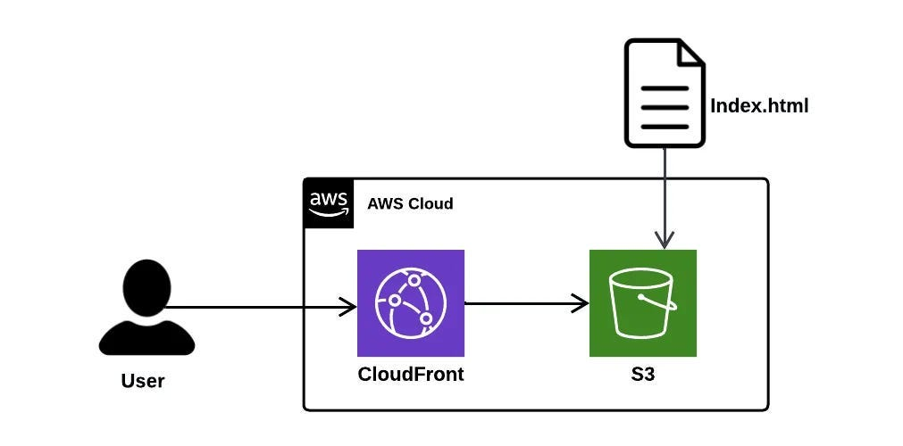

# S3 Static Website Hosting with CloudFront CDN

This workshop will guide you through setting up a static website using Amazon S3 for hosting and Amazon CloudFront as a Content Delivery Network (CDN) for global content distribution and improved performance.

## Table of Contents

- [S3 Static Website Hosting with CloudFront CDN](#s3-static-website-hosting-with-cloudfront-cdn)
  - [Table of Contents](#table-of-contents)
  - [Overview](#overview)
  - [Prerequisites](#prerequisites)
  - [Architecture](#architecture)
  - [Step-by-Step Setup](#step-by-step-setup)
    - [Part 1: Create and Configure S3 Bucket](#part-1-create-and-configure-s3-bucket)
    - [Part 2: Upload Website Files](#part-2-upload-website-files)
    - [Part 3: Configure S3 Static Website Hosting](#part-3-configure-s3-static-website-hosting)
    - [Part 4: Create CloudFront Distribution](#part-4-create-cloudfront-distribution)
    - [Part 5: Test Your Setup](#part-5-test-your-setup)
  - [Best Practices](#best-practices)
    - [Security](#security)
    - [Performance](#performance)
    - [Cost Optimization](#cost-optimization)
    - [Monitoring](#monitoring)
  - [Cost Considerations](#cost-considerations)
  - [Troubleshooting](#troubleshooting)
    - [Common Issues](#common-issues)
    - [Useful Commands](#useful-commands)
  - [Cleanup](#cleanup)
  - [Additional Resources](#additional-resources)

## Overview

This setup provides:

- **Global Content Delivery**: CloudFront edge locations worldwide for faster content delivery
- **Cost-Effective Hosting**: S3 provides affordable static website hosting
- **High Availability**: 99.99% availability SLA from AWS
- **SSL/TLS Support**: HTTPS encryption for secure content delivery
- **Caching**: Reduced load times through CloudFront caching

## Prerequisites

Before starting, ensure you have:

- An AWS account with appropriate permissions
- Basic HTML/CSS files for your website (sample provided)
- Understanding of DNS concepts (optional but helpful)

## Architecture



**Components:**

- **S3 Bucket**: Stores your static website files (HTML, CSS, JS, images)
- **CloudFront Distribution**: CDN that caches and delivers content globally
- **Origin Access Control (OAC)**: Secures direct access to S3 bucket

## Step-by-Step Setup

### Part 1: Create and Configure S3 Bucket

1. **Navigate to S3 Console**

   - Open the [AWS Management Console](https://console.aws.amazon.com/)
   - Search for "S3" and select the S3 service

2. **Create a New Bucket**

   - Click "Create bucket"
   - **Bucket name**: Choose a globally unique name (e.g., `my-static-website-2025-unique`)
   - **Region**: Select your preferred AWS region (closer to your target audience)
   - **Object Ownership**: Select "ACLs disabled (recommended)"

3. **Configure Public Access Settings**
   - **Block Public Access settings**: Keep all options checked for now
   - We'll configure access through CloudFront later for better security
   - Click "Create bucket"

### Part 2: Upload Website Files

1. **Open Your Bucket**

   - Click on your newly created bucket name

2. **Upload Files**

   - Click "Upload"
   - Add your website files:
     - `index.html` (main page)
     - `error.html` (custom error page - optional)
     - CSS, JavaScript, and image files
   - Click "Upload"

   > **Note**: If you don't have website files, you can use the sample `index.html` provided in this repository.

### Part 3: Configure S3 Static Website Hosting

1. **Enable Static Website Hosting**

   - In your S3 bucket, go to the "Properties" tab
   - Scroll down to "Static website hosting"
   - Click "Edit"

2. **Configure Settings**

   - **Static website hosting**: Enable
   - **Hosting type**: Host a static website
   - **Index document**: `index.html`
   - **Error document**: `error.html` (optional)
   - Click "Save changes"

3. **Note the Website Endpoint**
   - Copy the bucket website endpoint URL (you'll need this for CloudFront)
   - Format: `http://bucket-name.s3-website-region.amazonaws.com`

### Part 4: Create CloudFront Distribution

1. **Navigate to CloudFront Console**

   - Search for "CloudFront" in the AWS console
   - Click "Create a CloudFront distribution"

2. **Configure Origin Settings**

   - **Origin domain**: Paste your S3 website endpoint (remove `http://`)
   - **Protocol**: HTTP only (S3 website endpoints don't support HTTPS)
   - **Origin path**: Leave blank
   - **Name**: Auto-generated (or customize)

3. **Configure Origin Access**

   - **Origin access**: Public (S3 website endpoints require public access)
   - For enhanced security with regular S3 endpoints, you can use Origin Access Control (OAC)

4. **Configure Default Cache Behavior**

   - **Path pattern**: Default (\*)
   - **Viewer protocol policy**: Redirect HTTP to HTTPS
   - **Allowed HTTP methods**: GET, HEAD
   - **Cache policy**: Managed-CachingOptimized
   - **Origin request policy**: None

5. **Configure Distribution Settings**

   - **Price class**: Use all edge locations (or select based on your needs)
   - **Alternate domain name (CNAME)**: Leave blank for now
   - **Custom SSL certificate**: Default CloudFront certificate
   - **Default root object**: `index.html`
   - **Description**: Add a meaningful description

6. **Create Distribution**
   - Review your settings
   - Click "Create distribution"
   - **Wait for deployment** (this can take 15-20 minutes)

### Part 5: Test Your Setup

1. **Test S3 Website Endpoint**

   - Visit your S3 website endpoint URL
   - Verify your website loads correctly

2. **Update S3 Bucket Policy** (if needed)
   - Go to S3 bucket → Permissions → Bucket policy
   - Add the following policy (replace `YOUR-BUCKET-NAME`):

```json
{
  "Version": "2012-10-17",
  "Statement": [
    {
      "Sid": "PublicReadGetObject",
      "Effect": "Allow",
      "Principal": "*",
      "Action": "s3:GetObject",
      "Resource": "arn:aws:s3:::YOUR-BUCKET-NAME/*"
    }
  ]
}
```

3. **Update Block Public Access**

   - Go to S3 bucket → Permissions → Block public access
   - Uncheck "Block all public access"
   - Confirm the changes

4. **Test CloudFront Distribution**
   - Once deployment is complete, copy the CloudFront domain name
   - Visit `https://your-distribution-domain.cloudfront.net`
   - Verify your website loads over HTTPS

## Best Practices

### Security

- Use Origin Access Control (OAC) instead of public S3 buckets when possible
- Enable AWS WAF for additional protection
- Implement proper CORS policies if needed
- Use HTTPS-only viewer protocol policy

### Performance

- Configure appropriate cache behaviors for different file types
- Set proper TTL (Time To Live) values
- Compress files before uploading
- Optimize images and use modern formats (WebP, AVIF)

### Cost Optimization

- Choose appropriate CloudFront price class based on your audience
- Monitor usage through CloudWatch
- Set up billing alerts
- Use S3 Intelligent Tiering for objects

### Monitoring

- Enable CloudFront access logs
- Set up CloudWatch alarms
- Monitor cache hit ratios
- Track error rates

## Cost Considerations

**S3 Costs:**

- Storage: ~$0.023/GB per month
- Requests: ~$0.0004 per 1,000 GET requests

**CloudFront Costs:**

- Data transfer: $0.085/GB for first 10TB/month
- Requests: $0.0075 per 10,000 HTTP requests

**Estimated monthly cost for a small website (1GB storage, 10GB transfer):**

- S3: ~$0.25
- CloudFront: ~$1.00
- **Total: ~$1.25/month**

## Troubleshooting

### Common Issues

1. **403 Forbidden Error**

   - Check bucket policy and public access settings
   - Verify index document is correctly named
   - Ensure files have proper permissions

2. **404 Not Found**

   - Verify file names and paths
   - Check default root object setting in CloudFront
   - Ensure index.html exists in the bucket

3. **Cache Issues**

   - Create invalidation in CloudFront for immediate updates
   - Check cache behaviors and TTL settings
   - Use versioning or cache-busting for dynamic updates

4. **HTTPS Certificate Issues**
   - Verify SSL certificate configuration
   - Check alternate domain name settings
   - Ensure certificate is in us-east-1 region

### Useful Commands

**Create CloudFront Invalidation:**

```bash
aws cloudfront create-invalidation \
  --distribution-id EDFDVBD6EXAMPLE \
  --paths "/*"
```

**Sync files to S3:**

```bash
aws s3 sync ./website s3://your-bucket-name --delete
```

## Cleanup

To avoid ongoing charges:

1. **Delete CloudFront Distribution**

   - Disable the distribution first
   - Wait for status to change to "Disabled"
   - Delete the distribution

2. **Empty and Delete S3 Bucket**

   - Delete all objects in the bucket
   - Delete the bucket itself

3. **Check for Additional Resources**
   - Review any custom SSL certificates
   - Check for Route 53 hosted zones (if used)

## Additional Resources

- [AWS S3 Static Website Hosting Documentation](https://docs.aws.amazon.com/AmazonS3/latest/userguide/WebsiteHosting.html)
- [CloudFront Developer Guide](https://docs.aws.amazon.com/cloudfront/)
- [AWS Well-Architected Framework](https://aws.amazon.com/architecture/well-architected/)

---

**Workshop Duration:** 45-60 minutes  
**Difficulty Level:** Beginner to Intermediate  
**Last Updated:** July 2025

For questions or issues with this workshop, please create an issue in the repository or contact the workshop maintainers.
